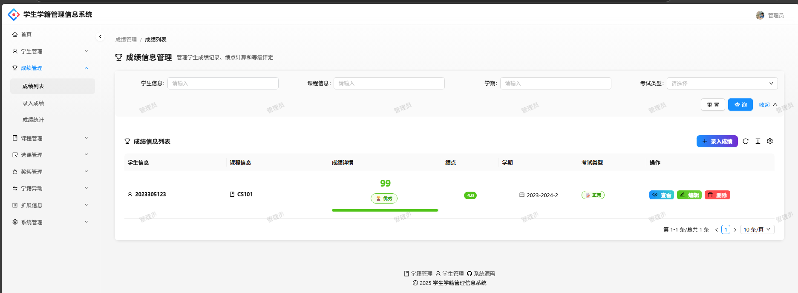

# 🎓 学生学籍管理信息系统 (SAR_MIS)

[](LICENSE)
[](https://spring.io/projects/spring-boot)
[](https://reactjs.org/)
[](https://www.typescriptlang.org/)
[](https://ant.design/) []([Mengxun326/SAR_MIS](https://github.com/Mengxun326/SAR_MIS)) []([Mengxun326/SAR_MIS](https://github.com/Mengxun326/SAR_MIS))

> 🚀 智能化、现代化的学生学籍管理解决方案

一个功能完整的学生学籍管理系统，提供学生信息管理、成绩管理、课程管理、学籍异动、奖惩记录等全方位的学籍管理功能。采用前后端分离架构，为学校提供高效、安全、易用的数字化管理平台。

## ✨ 主要特性

### 🔐 权限管理
- **多角色权限体系**：管理员、教师、学生三级权限
- **安全认证**：Session + JWT双重认证机制
- **接口权限控制**：细粒度的API权限管理

### 📊 核心功能模块

#### 👥 学生管理
- 学生基本信息的增删改查
- 批量导入导出学生数据
- 学籍状态管理（在读、休学、毕业等）
- 学生信息详情页面

#### 📚 课程管理
- 课程信息维护（课程代码、名称、学分等）
- 课程开设管理
- 教师课程分配
- 课程时间安排

#### 🎯 成绩管理
- 成绩录入与修改
- GPA自动计算
- 成绩统计分析
- 成绩分布图表
- 成绩排名功能

#### 📝 选课管理
- 在线选课系统
- 选课冲突检测
- 选课人数限制
- 退课功能

#### 🏆 奖惩管理
- 奖励记录管理（奖学金、荣誉等）
- 处分记录管理
- 处分撤销功能
- 奖惩统计报表

#### 🔄 学籍异动
- 学籍变更申请（转专业、休学、复学、退学等）
- 异动审批流程
- 异动记录查询
- 审批状态跟踪

#### 👨‍👩‍👧‍👦 扩展信息
- 家庭信息管理
- 健康档案管理
- 个人资料完善

#### 📈 数据统计
- 首页数据大屏
- 实时统计图表
- 多维度数据分析
- 可视化报表

### 🎨 界面特色
- **现代化UI设计**：基于Ant Design设计语言
- **响应式布局**：完美适配桌面端和移动端
- **深色/浅色主题**：支持主题切换
- **国际化支持**：多语言界面
- **无障碍访问**：符合WCAG标准

## 🛠️ 技术栈

### 后端技术
- **框架**：Spring Boot 2.7.0
- **数据库**：MySQL 8.0
- **ORM**：MyBatis-Plus 3.5.1
- **缓存**：Redis 6.0
- **安全**：Spring Security
- **API文档**：Knife4j (Swagger)
- **工具类**：Hutool、Apache Commons

### 前端技术
- **框架**：React 18.0 + TypeScript 4.7
- **UI库**：Ant Design 5.0 + Ant Design Pro
- **状态管理**：Umi Max
- **构建工具**：Umi 4.0
- **样式**：Less + CSS Modules
- **图表**：ECharts、AntV

### 开发工具
- **代码管理**：Git
- **构建工具**：Maven + npm
- **代码规范**：ESLint + Prettier
- **IDE推荐**：IntelliJ IDEA + VS Code

## 📁 项目结构

```
SAR_MIS/
├── springboot-init-master/          # 后端项目
│   ├── src/main/java/com/yupi/project/
│   │   ├── annotation/              # 自定义注解
│   │   ├── common/                  # 通用类
│   │   ├── config/                  # 配置类
│   │   ├── constant/                # 常量定义
│   │   ├── controller/              # 控制器层
│   │   │   ├── StudentController.java
│   │   │   ├── CourseController.java
│   │   │   ├── ScoreController.java
│   │   │   ├── UserController.java
│   │   │   ├── StatisticsController.java
│   │   │   └── ...
│   │   ├── exception/               # 异常处理
│   │   ├── mapper/                  # 数据访问层
│   │   ├── model/                   # 数据模型
│   │   │   ├── dto/                 # 数据传输对象
│   │   │   ├── entity/              # 实体类
│   │   │   └── vo/                  # 视图对象
│   │   ├── service/                 # 业务逻辑层
│   │   │   ├── impl/                # 业务实现类
│   │   │   └── ...Service.java
│   │   └── utils/                   # 工具类
│   ├── src/main/resources/
│   │   ├── application.yml          # 配置文件
│   │   ├── mapper/                  # MyBatis映射文件
│   │   └── sql/                     # 数据库脚本
│   └── pom.xml                      # Maven配置
│
├── yupi-antd-frontend-init-master/  # 前端项目
│   ├── config/                      # 配置文件
│   │   ├── config.ts                # 全局配置
│   │   ├── proxy.ts                 # 代理配置
│   │   └── routes.ts                # 路由配置
│   ├── public/                      # 静态资源
│   ├── src/
│   │   ├── components/              # 公共组件
│   │   ├── constants/               # 常量定义
│   │   ├── hooks/                   # 自定义Hooks
│   │   ├── pages/                   # 页面组件
│   │   │   ├── Welcome.tsx          # 首页
│   │   │   ├── Student/             # 学生管理
│   │   │   ├── Course/              # 课程管理
│   │   │   ├── Score/               # 成绩管理
│   │   │   ├── StatusChange/        # 学籍异动
│   │   │   └── ...
│   │   ├── services/                # API服务
│   │   ├── utils/                   # 工具函数
│   │   └── app.tsx                  # 应用入口
│   ├── package.json                 # 依赖配置
│   └── tsconfig.json                # TypeScript配置
│
├── docs/                            # 项目文档
├── README.md                        # 项目说明
└── LICENSE                          # 许可证
```

## 🚀 快速开始

### 环境要求
- **Java**: JDK 8+
- **Node.js**: 16.0+
- **MySQL**: 8.0+
- **Redis**: 6.0+
- **Maven**: 3.6+

### 1. 克隆项目
```bash
git clone https://github.com/Mengxun326/SAR_MIS.git
cd SAR_MIS
```

### 2. 数据库初始化
```bash
# 创建数据库
mysql -u root -p
CREATE DATABASE student_management CHARACTER SET utf8mb4 COLLATE utf8mb4_unicode_ci;

# 导入数据表和测试数据
mysql -u root -p student_management < springboot-init-master/sql/create_table.sql
```

### 3. 后端启动
```bash
cd springboot-init-master

# 修改配置文件
vim src/main/resources/application.yml
# 配置数据库连接、Redis等

# 启动项目
mvn spring-boot:run
```

### 4. 前端启动
```bash
cd yupi-antd-frontend-init-master

# 安装依赖
npm install

# 启动开发服务器
npm start
```

### 5. 访问系统
- 前端地址：http://localhost:8000
- 后端接口：http://localhost:8101/api
- 接口文档：http://localhost:8101/api/doc.html

### 默认账号
```
管理员账号：admin / 12345678
教师账号：teacher / 12345678
学生账号：user / 12345678
```

## 📖 功能说明

### 核心业务流程

#### 1. 学生信息管理流程
```
学生注册 → 信息录入 → 学籍建立 → 信息维护 → 状态变更
```

#### 2. 成绩管理流程
```
课程开设 → 学生选课 → 成绩录入 → 成绩审核 → 成绩发布
```

#### 3. 学籍异动流程
```
异动申请 → 材料审核 → 审批处理 → 结果通知 → 状态更新
```

### 权限说明

| 角色 | 权限范围 |
|------|----------|
| **管理员** | 全部功能的增删改查权限、用户管理、系统配置 |
| **教师** | 课程管理、成绩录入、学生信息查看、异动审批 |
| **学生** | 个人信息查看、选课、成绩查询、异动申请 |

## 📱 系统截图

### 首页大屏


### 学生管理


### 成绩管理


### 课程管理


## 🔧 开发指南

### 添加新的业务模块

#### 1. 后端开发
```bash
# 1. 创建实体类
src/main/java/com/yupi/project/model/entity/YourEntity.java

# 2. 创建DTO类
src/main/java/com/yupi/project/model/dto/your-module/YourAddRequest.java
src/main/java/com/yupi/project/model/dto/your-module/YourUpdateRequest.java
src/main/java/com/yupi/project/model/dto/your-module/YourQueryRequest.java

# 3. 创建Mapper接口
src/main/java/com/yupi/project/mapper/YourMapper.java

# 4. 创建Service层
src/main/java/com/yupi/project/service/YourService.java
src/main/java/com/yupi/project/service/impl/YourServiceImpl.java

# 5. 创建Controller
src/main/java/com/yupi/project/controller/YourController.java
```

#### 2. 前端开发
```bash
# 1. 生成API接口
npm run openapi

# 2. 创建页面组件
src/pages/YourModule/List.tsx
src/pages/YourModule/Add.tsx
src/pages/YourModule/Edit.tsx

# 3. 添加路由配置
config/routes.ts

# 4. 添加菜单配置
src/constants/index.ts
```

### 代码规范

#### 后端规范
- 遵循阿里巴巴Java开发手册
- 使用驼峰命名法
- 控制器方法使用RESTful风格
- 业务异常使用自定义异常类

#### 前端规范
- 遵循Airbnb JavaScript规范
- 组件使用PascalCase命名
- 文件使用kebab-case命名
- 使用TypeScript严格模式

## 🚦 测试

### 单元测试
```bash
# 后端测试
cd springboot-init-master
mvn test

# 前端测试
cd yupi-antd-frontend-init-master
npm test
```

### 接口测试
- 使用Knife4j进行接口调试
- 访问地址：http://localhost:8101/api/doc.html

## 📦 部署

### Docker部署（推荐）
```bash
# 构建镜像
docker-compose build

# 启动服务
docker-compose up -d
```

### 传统部署
```bash
# 后端打包
cd springboot-init-master
mvn clean package -DskipTests

# 前端打包
cd yupi-antd-frontend-init-master
npm run build

# 部署到服务器
java -jar target/sar-mis-backend.jar
```

## 🤝 贡献指南

1. Fork 本仓库
2. 创建特性分支 (`git checkout -b feature/AmazingFeature`)
3. 提交更改 (`git commit -m 'Add some AmazingFeature'`)
4. 推送到分支 (`git push origin feature/AmazingFeature`)
5. 提交 Pull Request

### 贡献者
- [@Mengxun326](https://github.com/Mengxun326) - 项目负责人

## 📄 许可证

本项目基于 MIT 许可证开源 - 查看 [LICENSE](LICENSE) 文件了解详情

## 🔗 相关链接

- [项目文档](docs/)
- [API文档](http://localhost:8101/api/doc.html)
- [更新日志](CHANGELOG.md)
- [问题反馈](https://github.com/Mengxun326/SAR_MIS/issues)

## 📞 联系我们

- 📧 邮箱：xingchen@qq.com
- 🐛 问题反馈：[GitHub Issues](https://github.com/Mengxun326/SAR_MIS/issues)
- 💬 技术交流群：123456789

---

<div align="center">

**⭐ 如果这个项目对您有帮助，请给我们一个Star！**

Made with ❤️ by [星辰](https://github.com/Mengxun326)

</div> 